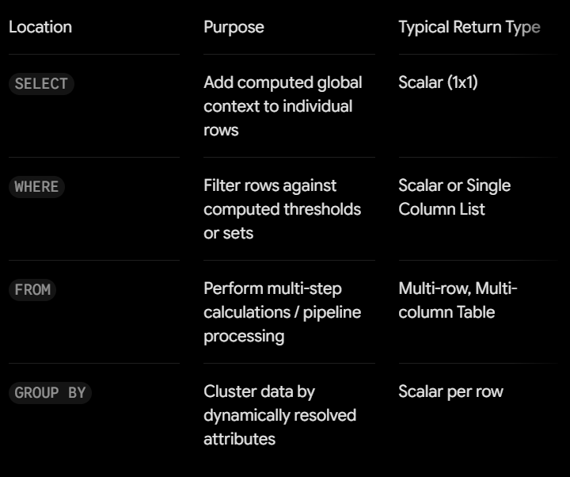

# Journal - {{2026-09-08}} - {{Subqueries}}

Use this version only if you want more structure. The basic `entry.md` is enough for most days.

## Today in one sentence
- Gets ko na mga 3/4 yung concept ng subqueries

## What I learned
- How to use subqueries in SELECT and WHERE.
- Best practices in formatting SQL codes

## Terms  I am still learning
- **Parellelism**
- **Source Freshness**
- **Workers/Executors**

## What confused me
- **Subqueries in FROM** - gets na derived tables ito pero i need more examples on how to use it.

## One small next step
- [ ] Chapter 3: Correlated Queries, Nested Queries, and Common Table Expressions
- [ ] Use git commands

## Git checkpoint
- [x] I created or updated a file
- [x] I wrote a commit
- [x] I pushed my changes

## Decisions or assumptions (optional)
- 

## Evidence from today (optional)
 

 - Learn more about SQL code formatting here: [Holywell's Style Guide](https://www.sqlstyle.guide/)

## Reflection (optional)
- What felt easy today? Gets ang paggamit ng subqueries sa SELECT at WHERE.
- What felt difficult today? Hindi pa rin gaanong gamay ang paggamit ng subqery sa FROM
- What do I want to understand better next time? 

## Mood or meme (optional)
- Getting there~
