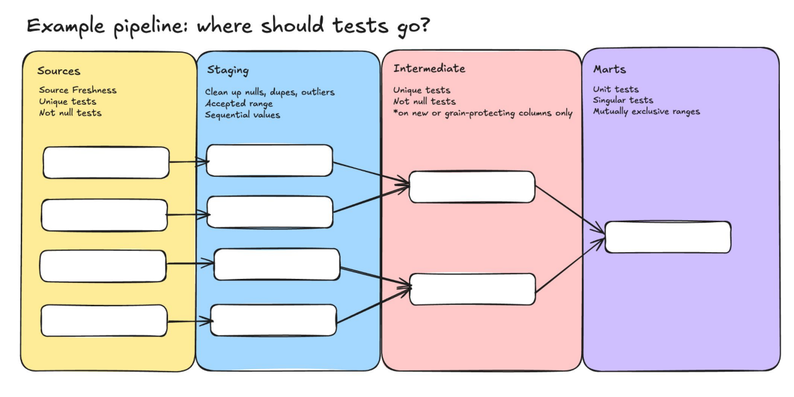

# Journal - {{2026-09-10}} - {{OULAD}}

## Today in one sentence
- Today I learnt that there are better ways of doing things

## What I learned
- Simplified 700 lines of code into 40 lines by using dynamic sql code for profiling instead of profiling table by table, column by column, and using UNION ALL.
- Data profiling include: Null, unique values, min/max values, and most common value per column. 
- Data profiling should be done first in the workflow so that the team can collectively identify the issues and how to proceed.
- It's best to be familiar with the context of the dataset ! ! !

## Terms I am still learning
- **Unit Tests** - validates transformation logic before deploying models
- ** Grain-protecting columns ** -  FKs and PKs or ID columns
- **Singular Tests** - "fully customizable SQL logic to enforce strict data quality checks" [singular tests](https://www.deeplearningnerds.com/writing-singular-tests-in-dbt-a-practical-example/)

## What confused me
- Difference between DQ_flag checks and data profiling

## One small next step
- [ ] Finish data manip in sql

## Git checkpoint
- [x] I created or updated a file
- [ ] I wrote a commit
- [x] I pushed my changes

## Decisions or assumptions (optional)
- It's fine to leave NULLS as is. Should be flagged and get back to it later.

## Evidence from today (optional)
- 

## Reflection (optional)
- What felt easy today? Understood concepts behind data profiling and applied dynamic codes
- What felt difficult today? I still don't understand where to put the tests in the data flow/github folders
- What do I want to understand better next time? How to create dq_tests compilation on all tables

## Mood or meme (optional)
- Still alive but i'm barely breathing~
